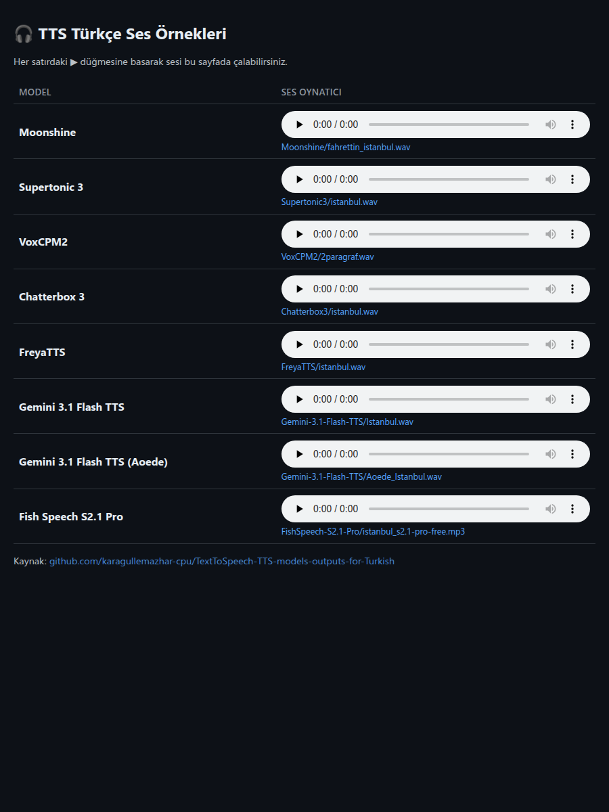

# TextToSpeech (TTS) models outputs for Turkish

Türkçe metin-sentez (TTS) modelleriyle üretilmiş ses örnekleri.

## Sayfa önizlemesi

> Not: GitHub, README işaretleyicisine etkileşimli canlı bir sayfa gömmeyi (iframe) olduğu gibi,
> gömülü ses oynatıcıyı da desteklemez. Oynatıcı sayfası GitHub Pages üzerinden sunulur ve
> sayfa yukarıdaki görsele/bağlantıya tıklanarak açılır; tek tek dosyalar da GitHub'ın dosya
> görüntüleyicisinde çalınabilir.

## Notlar

- Tüm dosyalar tarayıcıda oynatılabilir WAV / MP3 formatındadır.
